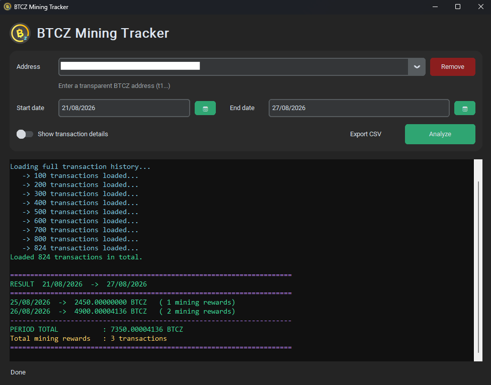

# BTCZ Mining Tracker

A simple desktop app to check how many **BitcoinZ (BTCZ)** coins arrived on a transparent address for a specific day or date range, with a focus on **mining rewards**.

Built for the BitcoinZ community.



## Features

- Check received BTCZ for **one day** or a **date range**
- Highlight **mining rewards**
- Fast mode for a single day
- Full history mode for longer periods
- Optional transaction details
- Calendar date picker
- Address history dropdown (saved locally)
- Remove saved addresses
- Export results to **CSV**
- Dark modern UI
- Official BTCZ logo in the app header and window icon

## Requirements

- Windows, Linux or macOS
- Python 3.10+
- Internet connection (uses [explorer.getbtcz.com](https://explorer.getbtcz.com/))

## Installation

```bash
git clone https://github.com/DADzCore/btcz-mining-tracker.git
cd btcz-mining-tracker
python -m venv venv# btcz-mining-tracker
